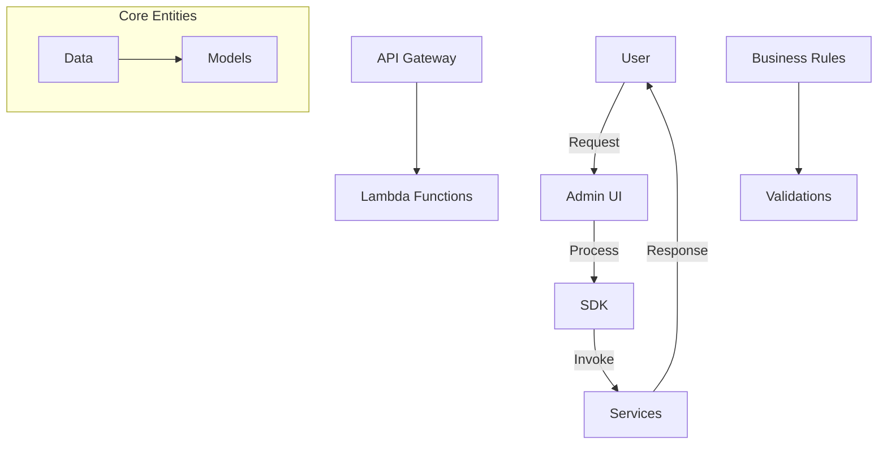
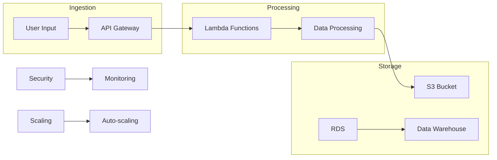

# Project Overview

## Purpose and Key Features
This project provides a foundational architecture for generative AI applications on AWS, offering scalability, flexibility, and integration with AWS services.

## Target Audience and Use Cases
- AI researchers and developers
- Enterprises integrating AI solutions
- Use cases: NLP, image recognition, etc.

## Tech Stack Overview
- Frontend: Nuxt.js, Tailwind CSS
- Backend: Python, FastAPI
- AWS Services: S3, Lambda, RDS

# Architecture Documentation

## A. Logical Architecture Diagram

## B. Technical Data Flow Diagram

# Setup & Installation

## Prerequisites
- AWS account with access to S3, Lambda, RDS
- Node.js v14.x, Python 3.8

## Step-by-Step Installation
1. Clone the repository and navigate to the project directory.
2. Install dependencies using `pip install -r sdk/reqs.txt`.

## Configuration Details
- Set up a `.env` file with AWS credentials.

# Usage Guide

## Basic Usage Examples
- Refer to `examples/` for sample scripts.

## Common Scenarios
- Deploying NLP models using the SDK.

## API Documentation
- Detailed API docs available in `docs/api.md`.

# Development

## Local Setup
- Run frontend and backend locally for development.

## Testing
- Use PyTest for backend and Jest for frontend.

## Contributing Guidelines
- Refer to `CONTRIBUTING.md` for contribution details.

# Troubleshooting

## Common Issues
- Refer to `docs/troubleshooting.md` for solutions.

## Debug Procedures
- Use logging and monitoring tools for debugging.

## Support Contacts
- Contact support at `support@example.com`.

# Security & Performance

## Security Features
- AWS Cognito for authentication.

## Performance Optimization
- Use caching strategies with Amazon ElastiCache.

## Best Practices
- Follow AWS security best practices.

# License & Credits

## License Information
- Licensed under the MIT License.

## Acknowledgments
- Acknowledges contributors and third-party tools. 
