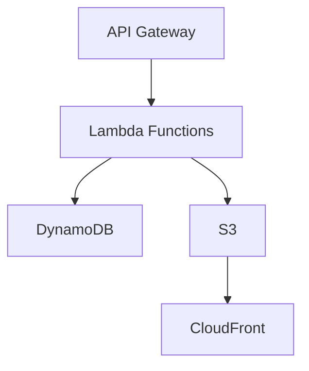

# Project Title

## Overview

This project is a serverless airline booking application built using AWS services. It provides a scalable and efficient way to manage airline bookings.

## Architecture



The architecture of this application is designed to leverage AWS services for scalability, reliability, and cost-effectiveness. The main components include:
- **API Gateway**: Serves as the entry point for all client requests.
- **Lambda Functions**: Handle business logic and interact with other AWS services.
- **DynamoDB**: Used for storing booking data.
- **S3**: Stores static assets and media files.
- **CloudFront**: Distributes content globally with low latency.

## Setup Instructions

1. Clone the repository:
   ```bash
   git clone https://github.com/your-repo/aws-serverless-airline-booking.git
   ```
2. Navigate to the project directory:
   ```bash
   cd aws-serverless-airline-booking
   ```
3. Install dependencies:
   ```bash
   npm install
   ```
4. Deploy the application:
   ```bash
   serverless deploy
   ```

## Usage

- Access the application via the deployed API Gateway endpoint.
- Use the web interface to make and manage bookings.

## Contribution Guidelines

We welcome contributions! Please see the [CONTRIBUTING.md](CONTRIBUTING.md) file for more information.

## License

This project is licensed under the terms of the MIT license. See the [LICENSE](LICENSE) file for details. 
