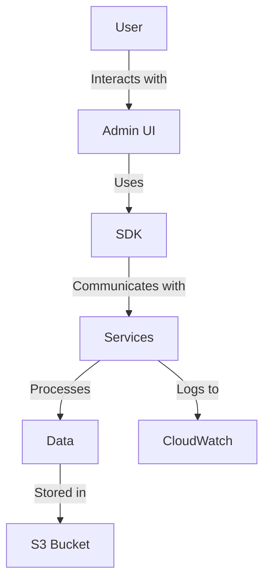

# Project Overview

This project is an AWS foundational architecture for generative AI applications. It provides a robust framework for building and deploying AI-driven solutions with key features such as scalability, security, and ease of integration.

- **Key Features and Benefits**:
  - Scalable architecture leveraging AWS services
  - Secure data handling and processing
  - Flexible integration with various AI models

- **Target Audience and Use Cases**:
  - AI developers and data scientists
  - Enterprises looking to integrate AI into their workflows
  - Use cases include natural language processing, image recognition, and more.

# Architecture Overview

## System Architecture Diagram


## Description of Each Major Component
- **Admin UI**: Provides a user-friendly interface for managing AI workflows.
- **SDK**: Facilitates communication with backend services.
- **Services**: Core processing units handling AI tasks.
- **Data Storage**: Utilizes AWS S3 for scalable storage.

## Flow of Data and Interactions
Data flows from the user interface through the SDK to backend services, where it is processed and stored in AWS S3. Logs and metrics are captured in AWS CloudWatch.

## Key AWS Services Utilized
- **Amazon S3**: For data storage
- **AWS Lambda**: For serverless processing
- **Amazon CloudWatch**: For monitoring and logging

# Repository Structure

## Tree View
```
.
├── admin-ui/
│   ├── frontend/
│   └── backend/
├── sdk/
├── services/
└── docs/
```

## Purpose of Each Major Directory
- **admin-ui/**: Contains the frontend and backend for the admin interface.
- **sdk/**: Provides the software development kit for interacting with services.
- **services/**: Houses the core AI processing services.
- **docs/**: Documentation and guides.

## Key Configuration Files
- **nuxt.config.ts**: Configuration for the Nuxt.js frontend.
- **config.py**: Backend configuration settings.

# Prerequisites

## Required AWS Services and Permissions
- Access to AWS S3, Lambda, and CloudWatch
- IAM roles with permissions for these services

## Development Environment Setup
- Node.js and npm for frontend development
- Python 3.x for backend services

## Required IAM Roles and Policies
- Roles for accessing S3, Lambda, and CloudWatch

## Dependencies and Software Versions
- Node.js 14.x
- Python 3.8

# Installation & Deployment

## Step-by-Step Setup Instructions
1. Clone the repository:
   ```bash
   git clone <repository-url>
   ```
2. Navigate to the project directory:
   ```bash
   cd <project-directory>
   ```

## Environment Variables Configuration
- Set up a `.env` file with AWS credentials and other necessary variables.

## AWS Resources Provisioning Steps
- Use AWS CloudFormation or Terraform to provision resources.

## Local Development Setup
- Run the frontend and backend locally using npm and Python.

## Production Deployment Guide
- Deploy using AWS Elastic Beanstalk or AWS Lambda.

# Component Details

## Admin UI
- **Purpose**: Provides a web interface for managing AI tasks.
- **Internal Architecture**: Built with Nuxt.js and Tailwind CSS.
- **Configuration Options**: Defined in `nuxt.config.ts`.

## SDK
- **Purpose**: Facilitates API communication.
- **Internal Architecture**: Python-based with RESTful endpoints.

## Services
- **Purpose**: Core AI processing.
- **Internal Architecture**: Microservices architecture using AWS Lambda.

# Security Considerations

## Authentication and Authorization
- Uses AWS Cognito for user management.

## Data Encryption
- Data encrypted at rest in S3 and in transit.

## Network Security
- VPC setup for secure networking.

## Best Practices Implemented
- Regular security audits and updates.

# Performance & Scalability

## Performance Optimization Techniques
- Caching strategies using AWS ElastiCache.

## Scaling Strategies
- Auto-scaling groups for Lambda functions.

## Resource Requirements
- Defined in AWS CloudFormation templates.

## Monitoring and Metrics
- Utilizes AWS CloudWatch for real-time monitoring.

# Development Guide

## Code Organization
- Follows MVC pattern for frontend and microservices for backend.

## Coding Standards
- Adheres to PEP 8 for Python and ESLint for JavaScript.

## Testing Strategy
- Unit and integration tests using PyTest and Jest.

## CI/CD Pipeline Setup
- Configured with AWS CodePipeline.

## Contributing Guidelines
- Refer to `CONTRIBUTING.md` for detailed guidelines.

# Troubleshooting

## Common Issues and Solutions
- Refer to the `docs/troubleshooting.md` for common issues.

## Logging and Monitoring
- Logs available in AWS CloudWatch.

## Debug Procedures
- Use AWS X-Ray for tracing.

# Examples & Usage

## Sample Use Cases
- NLP tasks, image recognition, etc.

## Code Examples
- Refer to `examples/` directory for sample code.

## API Usage Examples
- Detailed in `docs/api.md`.

# License & Attribution

## License Information
- Licensed under the MIT License.

## Third-Party Dependencies
- Listed in `package.json` and `requirements.txt`.

## Credits and Acknowledgments
- Contributions from the open-source community. 
