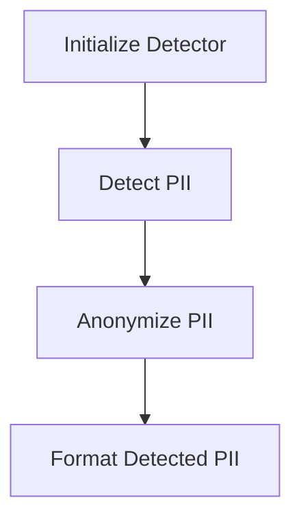

# Combined PII and Geo Detector

This project provides a Python class `CombinedPIIGeoDetector` that detects and anonymizes Personally Identifiable Information (PII) from text using regular expressions and the spaCy library.

## Table of Contents

1. [Introduction](#introduction)
2. [Features](#features)
3. [Installation](#installation)
4. [Usage](#usage)
5. [Examples](#examples)
6. [Architecture](#architecture)
7. [Components](#components)
8. [Use Cases](#use-cases)
9. [Troubleshooting](#troubleshooting)
10. [Contributing](#contributing)
11. [License](#license)
12. [Contact](#contact)

## Introduction

The `CombinedPIIGeoDetector` is designed to identify and anonymize various types of PII in text data. It leverages regular expressions for pattern matching and spaCy for advanced text processing, making it suitable for applications that require data privacy and protection.

## Features

- **Detection of PII**: Identifies phone numbers, email addresses, credit card numbers, national IDs, IP addresses, and more.
- **Anonymization**: Replaces detected PII with anonymized tokens while preserving the original format.
- **Advanced Text Processing**: Utilizes spaCy for natural language processing tasks.

## Installation

1. **Prerequisites**: Python 3.6 or later.
2. **Steps**: Install the required Python packages.

   ```bash
   pip install spacy
   python -m spacy download en_core_web_trf
   ```

## Usage

To use the `CombinedPIIGeoDetector`, initialize the detector and call its methods to detect and anonymize PII in text.

## Examples

Here's a step-by-step example demonstrating how to use the `CombinedPIIGeoDetector` class:

```python
from latest import CombinedPIIGeoDetector

# Initialize the detector
detector = CombinedPIIGeoDetector()

# Sample text containing PII
text = "Contact me at john.doe@example.com or +1-800-555-0199."

# Detect PII in the text
pii_entities = detector.detect_pii(text)
print("Detected PII:")
print(detector.format_detected_pii(pii_entities))

# Anonymize the detected PII in the text
anonymized_text = detector.anonymize_other_sensitive_info(text)
print("\nAnonymized Text:")
print(anonymized_text)
```

### Expected Output

```
Detected PII:
Email Addresses:
  - john.doe@example.com
Phone Numbers:
  - +1-800-555-0199

Anonymized Text:
Contact me at anonymised_email or anonymised_international_phone
```

## Architecture

The architecture of the `CombinedPIIGeoDetector` involves initializing the detector, detecting PII using regex patterns, and anonymizing the detected PII.



## Components

- **Regex Patterns**: Used for detecting specific PII types.
- **spaCy Model**: Utilized for text processing tasks.
- **Validation Functions**: Ensure the detected PII meets specific criteria.

## Use Cases

- **Data Privacy**: Anonymize sensitive information in documents.
- **Text Analysis**: Preprocess text data by removing PII.
- **Customer Support**: Redact sensitive information from communications.

## Troubleshooting

- **Model Not Found**: Ensure the spaCy model is installed using `python -m spacy download en_core_web_trf`.
- **Regex Mismatches**: Verify the regex patterns in the `self.patterns` dictionary.

## Contributing

Contributions are welcome! Please feel free to submit a Pull Request.

## License

This project is licensed under the MIT License.

## Contact

For any questions or issues, please contact the project maintainer. 
