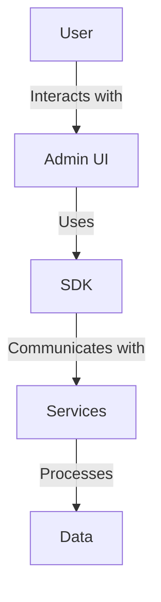

# Project Overview

This project is an AWS foundational architecture for generative AI applications. It provides a robust framework for building and deploying AI-driven solutions.

## Key Features and Benefits
- Scalable and flexible architecture
- Integration with AWS services for enhanced capabilities
- Designed for high performance and security

## Target Audience and Use Cases
- AI researchers and developers
- Enterprises looking to integrate AI solutions
- Use cases include natural language processing, image recognition, and more.

# Architecture Overview

## Logical & Technical Architecture


## Description of Major Components
- **Admin UI**: User interface for managing AI models and data.
- **SDK**: Provides tools and libraries for interacting with the platform.
- **Services**: Backend services for processing and managing data.

## Data Flow and Interactions
- User inputs are processed through the Admin UI and SDK.
- Data is managed and processed by backend services.

## Key AWS Services Utilized
- Amazon S3 for storage
- AWS Lambda for serverless computing
- Amazon RDS for database management

# Repository Structure

## Tree View
```
.
├── admin-ui/
│   ├── frontend/
│   └── backend/
├── sdk/
└── services/
```

## Purpose of Major Directories
- **admin-ui/**: Contains the frontend and backend for the admin interface.
- **sdk/**: Includes the software development kit for interacting with the platform.
- **services/**: Houses the core backend services.

## Key Configuration Files
- `nuxt.config.ts`: Configuration for the Nuxt.js frontend.
- `requirements.txt`: Python dependencies for the backend.

# Prerequisites

## Required AWS Services and Permissions
- Access to Amazon S3, AWS Lambda, and Amazon RDS
- IAM roles with necessary permissions

## Development Environment Setup
- Node.js and npm for frontend development
- Python and pip for backend development

## Required IAM Roles and Policies
- Roles for accessing AWS services securely

## Dependencies and Software Versions
- Node.js v14.x
- Python 3.8

# Installation & Deployment

## Step-by-Step Setup Instructions
1. Clone the repository and navigate to the project directory.
2. Install dependencies using `pip install -r sdk/reqs.txt`.

## Environment Variables Configuration
- Set up a `.env` file with necessary credentials.

## AWS Resources Provisioning Steps
- Use AWS CloudFormation or Terraform for resource provisioning.

## Local Development Setup
- Run the frontend and backend locally for development.

## Production Deployment Guide
- Deploy using AWS Elastic Beanstalk or AWS Lambda.

# Component Details

## Admin UI
- **Purpose**: Provides a user interface for managing AI models.
- **Internal Architecture**: Built with Nuxt.js and Tailwind CSS.

## SDK
- **Purpose**: Offers tools for developers to interact with the platform.
- **Configuration Options**: Customizable via environment variables.

## Services
- **Purpose**: Backend processing and data management.
- **API Endpoints**: Exposed via RESTful APIs.

# Security Considerations

## Authentication and Authorization
- Utilizes AWS Cognito for user management.

## Data Encryption
- Data encrypted at rest and in transit using AWS KMS.

## Network Security
- VPC setup with security groups and NACLs.

# Performance & Scalability

## Performance Optimization Techniques
- Caching strategies using Amazon ElastiCache.

## Scaling Strategies
- Auto-scaling groups for dynamic resource allocation.

# Development Guide

## Code Organization
- Modular structure with clear separation of concerns.

## Coding Standards
- Follows PEP 8 for Python and ESLint for JavaScript.

## Testing Strategy
- Unit and integration tests using PyTest and Jest.

# Troubleshooting

## Common Issues and Solutions
- Refer to the `docs/troubleshooting.md` for detailed solutions.

# Examples & Usage

## Sample Use Cases
- NLP model deployment and usage.

## Code Examples
- Refer to `examples/` directory for sample scripts.

# License & Attribution

## License Information
- Licensed under the MIT License.

## Third-Party Dependencies
- Lists all third-party libraries and their licenses.

## Credits and Acknowledgments
- Acknowledges contributors and third-party tools. 
