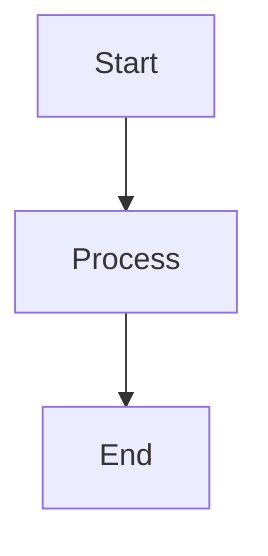

# Project Title

Brief description of the project and its purpose.

## Table of Contents

1. [Introduction](#introduction)
2. [Features](#features)
3. [Installation](#installation)
4. [Usage](#usage)
5. [Examples](#examples)
6. [Architecture](#architecture)
7. [Components](#components)
8. [Use Cases](#use-cases)
9. [Troubleshooting](#troubleshooting)
10. [Contributing](#contributing)
11. [License](#license)
12. [Contact](#contact)

## Introduction

Provide a detailed introduction to the project, explaining its goals and the problems it solves.

## Features

- List key features of the project.
- Highlight any unique aspects or capabilities.

## Installation

1. **Prerequisites**: List any software or tools required before installation.
2. **Steps**: Provide step-by-step instructions to install the project.

   ```bash
   # Example installation command
   pip install example-package
   ```

## Usage

Explain how to use the project, including any important commands or configurations.

## Examples

Provide examples of how to use the project, including code snippets and expected outputs.

```python
# Example code snippet
print("Hello, World!")
```

### Expected Output

```
Hello, World!
```

## Architecture

Describe the architecture of the project, including any diagrams or flowcharts.



## Components

Detail the main components of the project and their roles.

## Use Cases

- Describe potential use cases for the project.
- Explain how it can be applied in real-world scenarios.

## Troubleshooting

Provide solutions to common issues users might encounter.

## Contributing

Explain how others can contribute to the project.

## License

State the license under which the project is distributed.

## Contact

Provide contact information for users to reach out with questions or feedback. 
