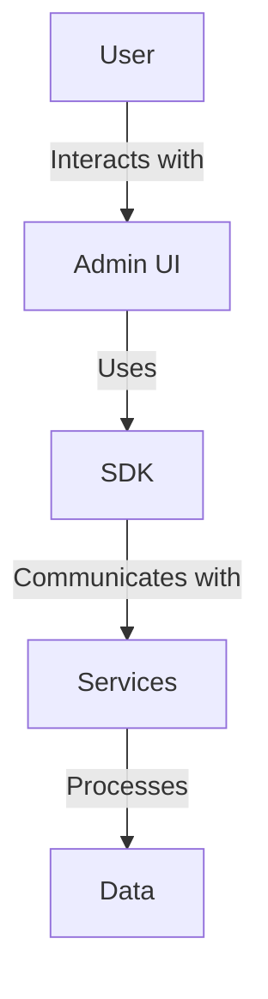

# Project Overview

This project is an AWS foundational architecture for generative AI applications. It provides a robust framework for building and deploying AI-driven solutions with key features such as scalability, security, and integration with AWS services.

## Key Features and Benefits
- Scalable architecture leveraging AWS services
- Secure data handling and processing
- Integration with AWS AI/ML services
- Flexible and customizable components

## Target Audience and Use Cases
- AI developers and data scientists
- Enterprises looking to integrate AI solutions
- Use cases include natural language processing, image recognition, and predictive analytics

# Architecture Overview

## Logical & Technical Architecture Diagram


## Description of Major Components
- **Admin UI**: User interface for managing AI workflows
- **SDK**: Software development kit for integrating AI capabilities
- **Services**: Backend services for data processing and model invocation

## Flow of Data and Interactions
- User inputs are processed through the Admin UI
- SDK facilitates communication with backend services
- Services handle data processing and model execution

## Key AWS Services Utilized
- Amazon S3 for data storage
- AWS Lambda for serverless computing
- Amazon SageMaker for model training and deployment

# Repository Structure

## Tree View
```
.
├── admin-ui/
│   ├── frontend/
│   └── backend/
├── sdk/
├── services/
└── docs/
```

## Purpose of Each Major Directory
- **admin-ui/**: Contains the frontend and backend for the admin interface
- **sdk/**: Provides the SDK for integrating AI capabilities
- **services/**: Hosts backend services for data processing
- **docs/**: Documentation and guides

## Key Configuration Files
- `nuxt.config.ts`: Configuration for the Nuxt.js frontend
- `requirements.txt`: Python dependencies for the backend

# Prerequisites

## Required AWS Services and Permissions
- Access to Amazon S3, AWS Lambda, and Amazon SageMaker
- IAM roles with permissions for AI/ML services

## Development Environment Setup
- Node.js and npm for frontend development
- Python 3.x for backend services

## Required IAM Roles and Policies
- Roles for accessing AWS AI/ML services
- Policies for data storage and processing

## Dependencies and Software Versions
- Node.js 14.x
- Python 3.8

# Installation & Deployment

## Step-by-Step Setup Instructions
1. Clone the repository
2. Install dependencies
3. Configure environment variables

## Environment Variables Configuration
- Set AWS credentials and region

## AWS Resources Provisioning Steps
- Deploy infrastructure using AWS CloudFormation

## Local Development Setup
- Run frontend and backend locally

## Production Deployment Guide
- Deploy to AWS using CI/CD pipeline

# Component Details

## Admin UI
- **Purpose**: Manage AI workflows
- **Internal Architecture**: Built with Nuxt.js
- **Configuration Options**: Tailwind CSS for styling

## SDK
- **Purpose**: Integrate AI capabilities
- **API Endpoints**: Provides access to AI models

## Services
- **Purpose**: Data processing and model invocation
- **Integration Points**: Connects with AWS services

# Security Considerations

## Authentication and Authorization
- Uses AWS Cognito for user management

## Data Encryption
- Encrypts data at rest and in transit

## Network Security
- VPC setup for secure networking

# Performance & Scalability

## Performance Optimization Techniques
- Caching strategies for faster response

## Scaling Strategies
- Auto-scaling with AWS Lambda

# Development Guide

## Code Organization
- Modular structure for maintainability

## Coding Standards
- Follows PEP 8 for Python code

## Testing Strategy
- Unit and integration tests

# Troubleshooting

## Common Issues and Solutions
- AWS service limits and quotas

## Logging and Monitoring
- CloudWatch for monitoring

# Examples & Usage

## Sample Use Cases
- Text classification with AI models

## Code Examples
- Example scripts in `examples/`

# License & Attribution

## License Information
- Licensed under the MIT License

## Third-Party Dependencies
- Lists all dependencies in `requirements.txt`

## Credits and Acknowledgments
- Contributions from the open-source community 
