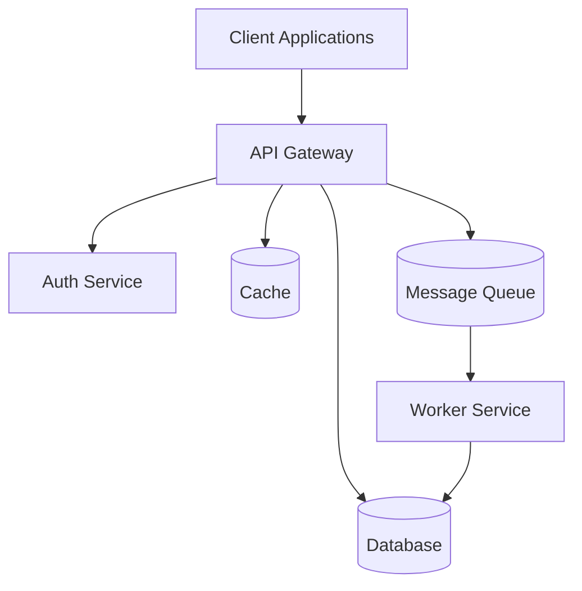
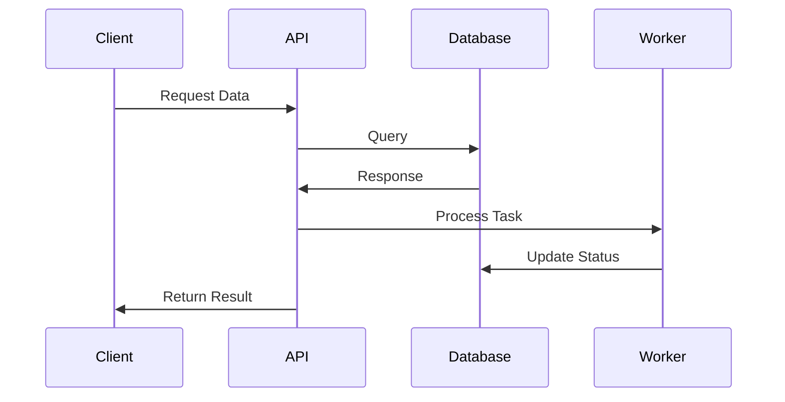
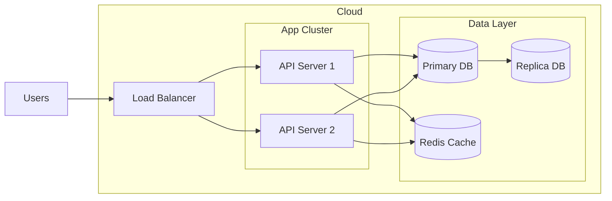

# Project Name

## Overview
This project is a serverless airline booking system built on AWS. It provides a comprehensive solution for managing airline bookings, including features for searching flights, booking tickets, and managing user accounts.

## Table of Contents
- [Features](#features)
- [Architecture](#architecture)
- [Prerequisites](#prerequisites)
- [Installation](#installation)
- [Configuration](#configuration)
- [Usage](#usage)
- [API Documentation](#api-documentation)
- [Development](#development)
- [Testing](#testing)
- [Deployment](#deployment)
- [Monitoring](#monitoring)
- [Troubleshooting](#troubleshooting)
- [Contributing](#contributing)
- [Security](#security)
- [License](#license)
- [Acknowledgments](#acknowledgments)

## Features
- **Flight Search**: Allows users to search for available flights based on various criteria.
- **Booking Management**: Users can book, cancel, and manage their flight reservations.
- **User Accounts**: Secure user authentication and profile management.

## Architecture
This section provides a high-level overview of the system architecture.

### System Components


### Data Flow


### Deployment Architecture


## Prerequisites
- Node.js v18+
- PostgreSQL 13+
- Docker
- Redis
- AWS account with necessary permissions

## Installation
```bash
# Clone the repository
git clone https://github.com/organization/project-name.git

# Navigate to project directory
cd project-name

# Install dependencies
npm install

# Set up environment variables
cp .env.example .env
```

## Configuration
1. Required environment variables:
   - `DATABASE_URL`: Connection string for the database
   - `API_KEY`: Authentication key for external services
   - `PORT`: Server port (default: 3000)

2. Optional configurations:
   - `LOG_LEVEL`: Logging verbosity (default: info)
   - `CACHE_TTL`: Cache duration in seconds

## Usage
```javascript
// Basic usage example
const client = new ProjectClient();
const result = await client.doSomething();
```

## API Documentation
### Endpoint: `GET /api/v1/resource`
- Description: Retrieves resource data
- Parameters:
  - `id` (required): Resource identifier
  - `fields` (optional): Comma-separated list of fields
- Response format:
  ```json
  {
    "id": "string",
    "name": "string",
    "status": "string"
  }
  ```

## Development
1. Development prerequisites
2. Code style guidelines
3. Branch naming conventions
4. Commit message format
5. Pull request process

## Testing
```bash
# Run unit tests
npm test

# Run integration tests
npm run test:integration

# Generate test coverage report
npm run test:coverage
```

## Deployment
1. Pre-deployment checklist
2. Deployment steps
3. Post-deployment verification
4. Rollback procedures

## Monitoring
1. Available metrics
2. Log locations
3. Health check endpoints
4. Alert configurations

## Troubleshooting
1. Problem: Description of common issue
   - Cause: Likely cause
   - Solution: Steps to resolve

2. Problem: Another common issue
   - Cause: Likely cause
   - Solution: Steps to resolve

## Contributing
1. Fork the repository
2. Create a feature branch
3. Make your changes
4. Run tests
5. Submit a pull request

## Security
- Security policy
- Vulnerability reporting process
- Security best practices
- Access control information

## License
This project is licensed under the MIT License - see the [LICENSE.md](LICENSE.md) file for details.

## Acknowledgments
- Credit to contributors
- Third-party libraries used
- Related projects or inspirations

---
**Note**: Customize this template by removing unnecessary sections or adding specific ones based on your project's needs. Keep documentation clear, concise, and up-to-date.

Last Updated: [DATE] 
