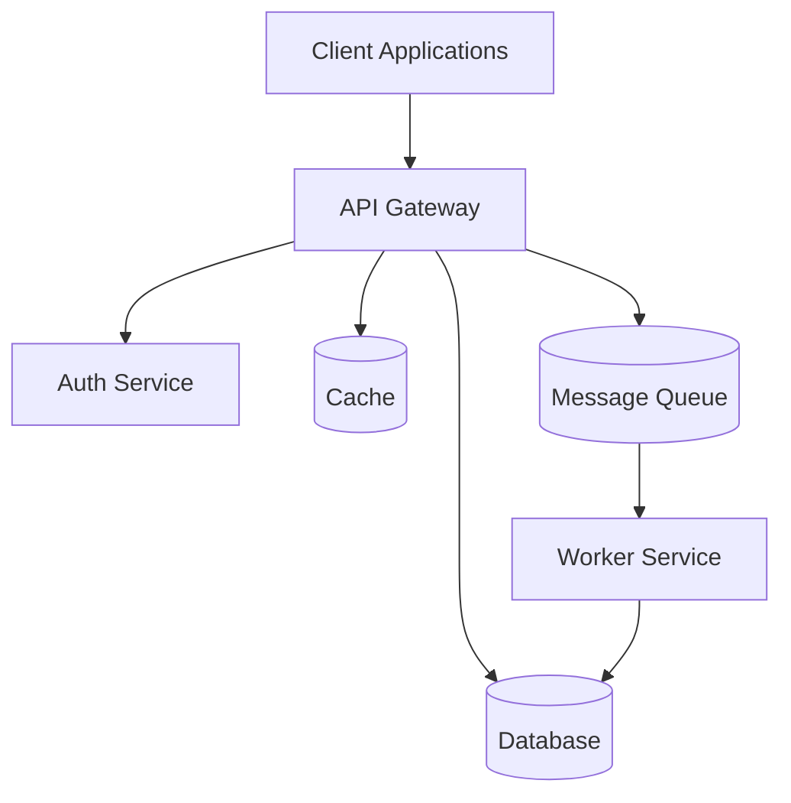
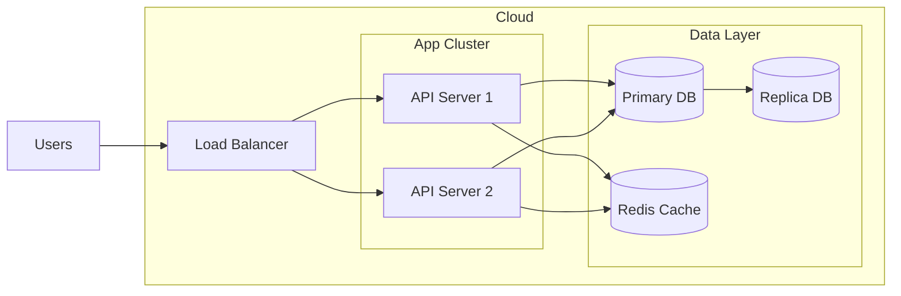

# Generative AI Application

## Overview
This project is a comprehensive generative AI application designed to process documents, manage prompts, and interact with AI models. It leverages AWS services for scalable and secure operations, including microservices, storage, and authentication mechanisms.

## Architecture
### Logical Architecture
This section provides a high-level overview of the system architecture.



### Technical Architecture
The technical architecture is based on AWS services, including VPC, ECS, and more.



## Installation
### Prerequisites
- Node.js v18+
- AWS CLI configured
- Docker

### Steps
```bash
# Clone the repository
git clone <repository-url>
cd <repository-directory>

# Install dependencies
npm install

# Set up environment variables
cp .env.example .env
```

## Usage
```javascript
// Basic usage example
const client = new ProjectClient();
const result = await client.doSomething();
```

## API Documentation
Refer to the `api_docs.html` in the `docs/api_docs` directory for API documentation rendered using Swagger UI.

## Development
- Follow the code style guidelines.
- Use branch naming conventions.
- Ensure all tests pass before submitting a pull request.

## Testing
```bash
# Run unit tests
npm test

# Run integration tests
npm run test:integration

# Generate test coverage report
npm run test:coverage
```

## Deployment
- Follow the pre-deployment checklist.
- Use `cdk deploy` for deploying the stack.

## Monitoring
- Use CloudWatch for monitoring.
- Set up alerts for critical metrics.

## Troubleshooting
- Refer to the troubleshooting guide for common issues and solutions.

## Contributing
- Fork the repository and create a feature branch.
- Make your changes and run tests.
- Submit a pull request.

## License
This project is licensed under the [LICENSE NAME] - see the [LICENSE.md](LICENSE.md) file for details.

## Acknowledgments
- Credit to contributors
- Third-party libraries used
- Related projects or inspirations

---
**Note**: Customize this template by removing unnecessary sections or adding specific ones based on your project's needs. Keep documentation clear, concise, and up-to-date. 
