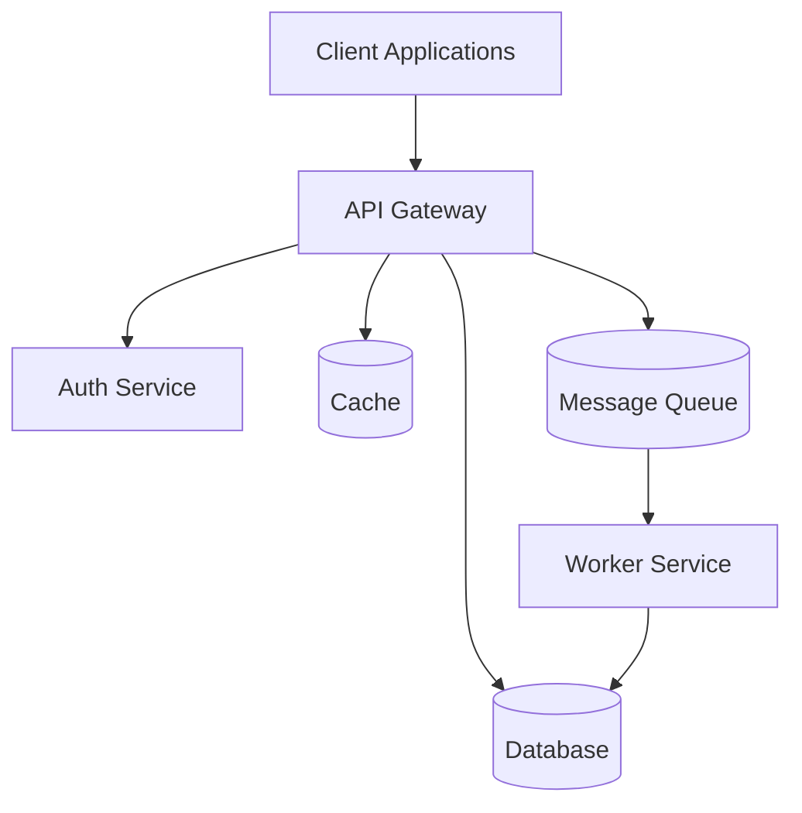
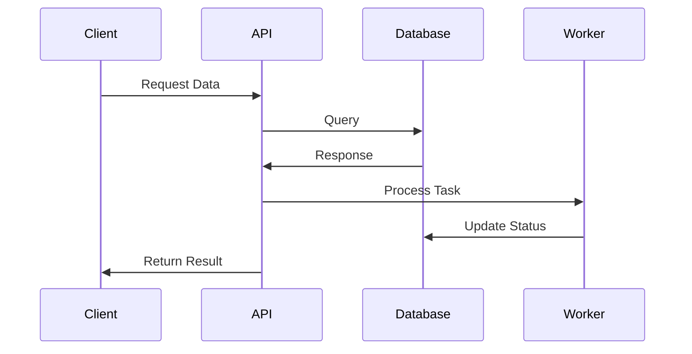
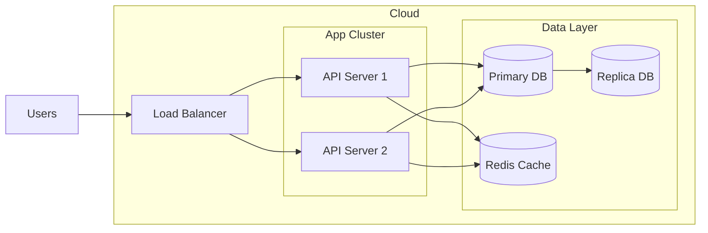

# Project Name

## Overview
Brief description of what this project does and its main purpose (2-3 sentences).

## Table of Contents
- [Features](#features)
- [Architecture](#architecture)
- [Prerequisites](#prerequisites)
- [Installation](#installation)
- [Configuration](#configuration)
- [Usage](#usage)
- [API Documentation](#api-documentation)
- [Development](#development)
- [Testing](#testing)
- [Deployment](#deployment)
- [Monitoring](#monitoring)
- [Troubleshooting](#troubleshooting)
- [Contributing](#contributing)
- [Security](#security)
- [License](#license)
- [Acknowledgments](#acknowledgments)

## Features
- Key feature 1 with brief description

## Architecture
This section provides a high-level overview of the system architecture.

### System Components


### Data Flow


### Deployment Architecture


Note: Update these diagrams to match your actual system architecture. The diagrams above are examples and should be modified to reflect your specific implementation.
- Key feature 2 with brief description
- Key feature 3 with brief description

## Prerequisites
List all system requirements, dependencies, and tools needed before installation:
- Runtime environment (e.g., Node.js v18+, Python 3.8+)
- Database (e.g., PostgreSQL 13+)
- Other system requirements (e.g., Docker, Redis)
- Required API keys or access tokens

## Installation
Step-by-step installation instructions:

```bash
# Clone the repository
git clone https://github.com/organization/project-name.git

# Navigate to project directory
cd project-name

# Install dependencies
npm install   # or equivalent for your stack

# Set up environment variables
cp .env.example .env
```

## Configuration
Explain configuration options and environment variables:

1. Required environment variables:
   - `DATABASE_URL`: Connection string for the database
   - `API_KEY`: Authentication key for external services
   - `PORT`: Server port (default: 3000)

2. Optional configurations:
   - `LOG_LEVEL`: Logging verbosity (default: info)
   - `CACHE_TTL`: Cache duration in seconds

## Usage
Provide examples of common use cases:

```javascript
// Basic usage example
const client = new ProjectClient();
const result = await client.doSomething();
```

Include examples for:
- Basic implementation
- Common workflows
- CLI commands (if applicable)
- Important function calls

## API Documentation
For REST APIs or libraries, document endpoints or main functions:

### Endpoint: `GET /api/v1/resource`
- Description: Retrieves resource data
- Parameters:
  - `id` (required): Resource identifier
  - `fields` (optional): Comma-separated list of fields
- Response format:
  ```json
  {
    "id": "string",
    "name": "string",
    "status": "string"
  }
  ```

## Development
Instructions for setting up development environment:

1. Development prerequisites
2. Code style guidelines
3. Branch naming conventions
4. Commit message format
5. Pull request process

## Testing
Explain testing procedures:

```bash
# Run unit tests
npm test

# Run integration tests
npm run test:integration

# Generate test coverage report
npm run test:coverage
```

## Deployment
Document deployment process:

1. Pre-deployment checklist
2. Deployment steps
3. Post-deployment verification
4. Rollback procedures

## Monitoring
Describe monitoring and logging:

1. Available metrics
2. Log locations
3. Health check endpoints
4. Alert configurations

## Troubleshooting
Common issues and solutions:

1. Problem: Description of common issue
   - Cause: Likely cause
   - Solution: Steps to resolve

2. Problem: Another common issue
   - Cause: Likely cause
   - Solution: Steps to resolve

## Contributing
Guidelines for contributing:

1. Fork the repository
2. Create a feature branch
3. Make your changes
4. Run tests
5. Submit a pull request

Include:
- Code review process
- Release process
- Contact information for maintainers

## Security
Security considerations and procedures:

- Security policy
- Vulnerability reporting process
- Security best practices
- Access control information

## License
Specify the license and any related information:

This project is licensed under the [LICENSE NAME] - see the [LICENSE.md](LICENSE.md) file for details.

## Acknowledgments
- Credit to contributors
- Third-party libraries used
- Related projects or inspirations

---
**Note**: Customize this template by removing unnecessary sections or adding specific ones based on your project's needs. Keep documentation clear, concise, and up-to-date.

Last Updated: [DATE]
