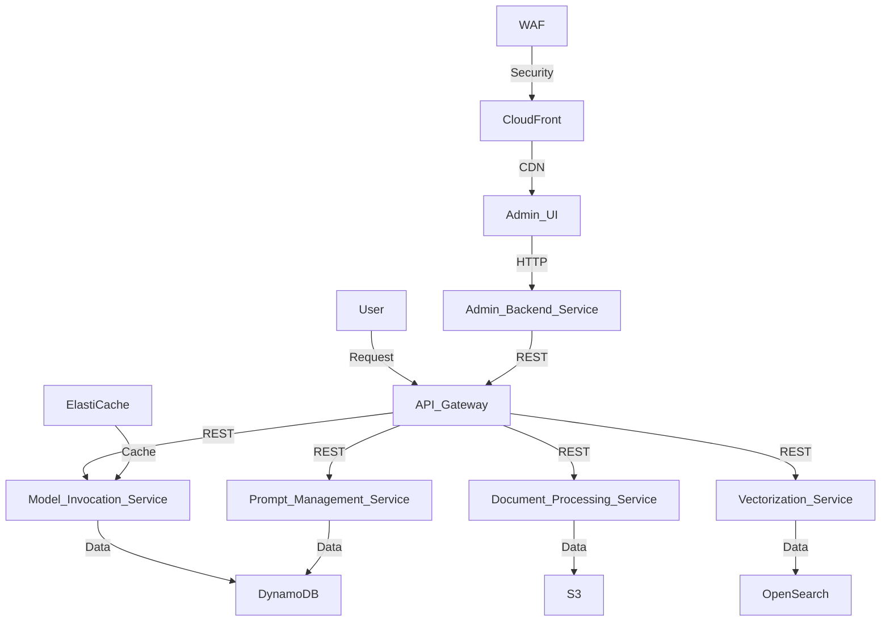

# Generative AI Applications Foundational Architecture

## Introduction

This project provides a scalable and efficient AWS foundational architecture for generative AI applications, enabling AI-driven tasks such as natural language processing and image recognition. It is designed to support AI researchers, developers, and enterprises in integrating AI solutions seamlessly.

### Latest Updates
- **Version 1.0.1**: Improved deployment scripts and added new API endpoints.
- **Version 1.0.0**: Initial release with core features and architecture.

## Solution Overview

This solution addresses the need for a robust and scalable architecture to support generative AI applications. It leverages AWS services to provide a secure, efficient, and scalable environment for AI-driven tasks. The architectural approach focuses on modularity, scalability, and security, ensuring that each component can be independently scaled and managed.

### AWS Services Used
- **Amazon S3**: Used for scalable storage solutions, including storing access logs and results of extraction processes. Enforced TLS for secure data transfer.
- **AWS Lambda**: Utilized for serverless compute tasks, providing efficient processing capabilities.
- **Amazon API Gateway**: Manages secure and scalable API interactions, integrating with AWS Cognito for authentication.
- **Amazon DynamoDB**: Used for storing application data, including job logs and vector store information.
- **Amazon ECS (Elastic Container Service)**: Hosts microservices using Fargate for serverless container management.
- **Amazon ElastiCache**: Provides Redis caching for asynchronous model invocation, enhancing performance.
- **Amazon OpenSearch Service**: Facilitates vector search and document indexing, with security policies for data protection.
- **AWS CloudFront**: Distributes content securely with WAF integration for enhanced security.
- **AWS WAF (Web Application Firewall)**: Protects the application from common web exploits, integrated with CloudFront.
- **AWS KMS (Key Management Service)**: Manages encryption keys for securing data at rest and in transit.
- **AWS IAM (Identity and Access Management)**: Manages roles and policies for secure access control across services.

### Security Features
- **AWS Cognito**: Provides user authentication and authorization, ensuring secure access to APIs.
- **VPC and Security Groups**: Configured to control inbound and outbound traffic, ensuring network security.
- **CloudWatch Logs**: Used for monitoring and logging, with encryption enabled for data protection.
- **IAM Policies**: Define permissions for accessing AWS resources, ensuring least privilege access.
- **TLS Enforcement**: Ensures secure data transfer by enforcing TLS 1.2 for all S3 buckets and endpoints.

### Architectural Diagram



### User Request Flow

The following is a comprehensive step-by-step flow of a user request from start to end, including authentication:

1. **User Initiation**: The user initiates a request through the Admin UI or SDK.
2. **Authentication**: The request is authenticated using AWS Cognito, which verifies the user's credentials and provides an access token.
3. **API Gateway**: The authenticated request is sent to the Amazon API Gateway, which serves as the entry point for all API requests.
4. **Request Routing**: The API Gateway routes the request to the appropriate microservice based on the request path and method.
5. **Authorization**: The microservice checks the user's permissions using IAM policies to ensure they have the necessary access rights.
6. **Processing**: The microservice processes the request, which may involve computations, data retrieval, or interactions with other services.
7. **Data Interaction**: The microservice interacts with AWS services such as DynamoDB for data storage, S3 for file handling, or OpenSearch for search operations.
8. **Response Generation**: After processing, the microservice generates a response, which includes the results of the requested operation.
9. **Response Return**: The response is sent back through the API Gateway to the user.
10. **User Notification**: The user receives the response, completing the request cycle.

This flow ensures that user requests are handled securely, efficiently, and in a scalable manner, leveraging AWS services for optimal performance and security.

### Technology Stack
- **AWS S3**: For scalable storage solutions.
- **AWS Lambda**: To handle serverless compute tasks efficiently.
- **AWS API Gateway**: For secure and scalable API management.
- **Node.js & Python**: For development flexibility and performance.

## Architecture Details

### Components
- **Admin UI**: Provides a user interface for managing AI tasks.
- **SDK**: Facilitates interaction with the platform.
- **Core Services**: Handle processing and data management.

### Integration Points
Integration with external systems is managed through secure API endpoints, ensuring seamless data exchange and processing.

### Scalability and Redundancy
The architecture supports auto-scaling and includes redundancy features to ensure high availability and fault tolerance.

## Features and Capabilities

### Key Features
- **Scalable Architecture**: Leverages AWS services for scalability.
- **Efficient Data Processing**: Optimized for AI-driven tasks.
- **Secure Operations**: Compliant with industry standards.

## Deployment Framework

### Infrastructure Requirements
- Detailed list of AWS services and configurations required.

### Deployment Instructions
1. Clone the repository.
2. Configure environment variables.
3. Deploy using CloudFormation.

### CI/CD Integration
Integrated with GitHub Actions for automated deployment and testing.

## Prerequisites and Setup

### Accounts and Permissions
- AWS account with necessary permissions.
- IAM roles and policies configured.

### Software Dependencies
- Node.js v14.x
- Python 3.8

## Implementation Guide

### Code Examples
```python
# Example code for using the SDK
from sdk import GenAISDK
sdk = GenAISDK(api_key='your_api_key')
result = sdk.perform_task('task_name')
```

### API References
- **Endpoint 1**: Request/response formats.
- **Endpoint 2**: Request/response formats.

## Cost Optimization

### Strategies
- Use of reserved instances for cost savings.
- Efficient use of AWS services to minimize costs.

## Security Considerations

### Best Practices
- Use of AWS Cognito for authentication.
- Encryption of data at rest and in transit.

## Operations and Monitoring

### Logging and Metrics
- CloudWatch for logging and monitoring.

### Troubleshooting
- Common issues and solutions.

## Performance Tuning

### Benchmarks
- Performance metrics for key operations.

### Optimization Strategies
- Caching and load balancing techniques.

## Project Structure

```
project-root/
├── admin-ui/
│   ├── frontend/
│   └── backend/
├── sdk/
├── services/
└── docs/
```
- **admin-ui/**: Contains the frontend and backend for the admin interface.
- **sdk/**: Software development kit for interacting with the platform.
- **services/**: Core services for processing and data management.
- **docs/**: Documentation and guides.

## Development Guide

### Workflow
- Branching strategy and code review process.

### Testing
- Unit and integration testing frameworks.

## License and Notices

### License
This project is licensed under the terms of the LICENSE file.

### Third-party Attributions
- List of third-party libraries and their licenses.

### Compliance Notices
- Compliance with industry standards and regulations.

## Contributing

Please refer to the `CONTRIBUTING.md` file for guidelines on contributing to this project.

## References

- [AWS Documentation](https://aws.amazon.com/documentation/)
- [Nuxt.js Documentation](https://nuxt.com/docs/getting-started/introduction) 
