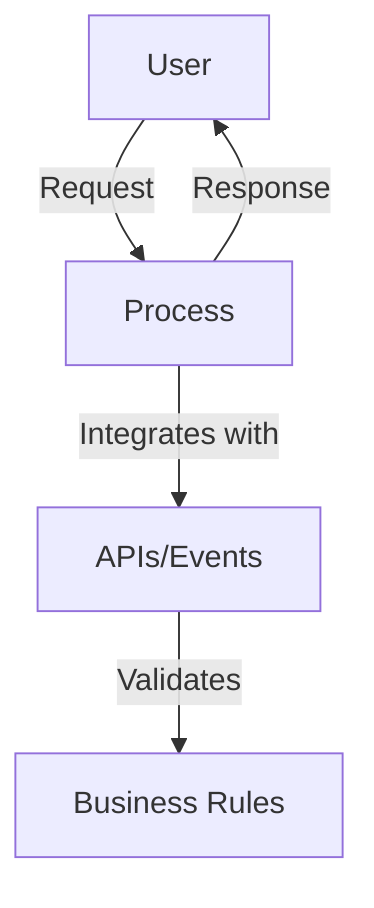
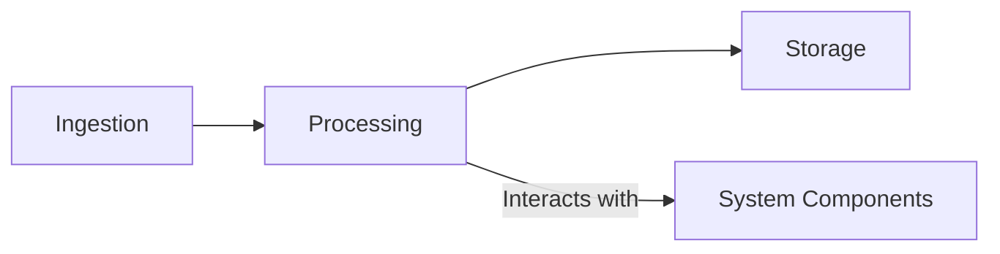

# Project Overview
This project is an AWS foundational architecture for generative AI applications, designed to provide scalable and efficient solutions for AI-driven tasks.

## Key Features and Benefits
- Scalable architecture leveraging AWS services
- Efficient data processing and storage
- Secure and compliant with industry standards

## Target Audience and Use Cases
- AI researchers and developers
- Enterprises looking to integrate AI solutions
- Use cases include natural language processing, image recognition, and more

## Logical Architecture Diagram


## Technical Data Flow Diagram


## Repository Structure
```
project-root/
├── admin-ui/
│   ├── frontend/
│   └── backend/
├── sdk/
├── services/
└── docs/
```
- **admin-ui/**: Contains the frontend and backend for the admin interface
- **sdk/**: Software development kit for interacting with the platform
- **services/**: Core services for processing and data management
- **docs/**: Documentation and guides

## Prerequisites
- AWS services: S3, Lambda, API Gateway
- Development environment: Node.js, Python
- IAM roles and policies for access control
- Dependencies: Listed in `requirements.txt` and `package.json`

## Installation & Deployment
1. Clone the repository and navigate to the project directory.
2. Configure environment variables as per `.env.example`.
3. Provision AWS resources using CloudFormation.
4. Set up local development environment.
5. Deploy to production using CI/CD pipeline.

## Component Details
### Admin UI
- **Purpose**: Provides a user interface for managing AI tasks
- **Internal Architecture**: Built with Nuxt.js and Tailwind CSS
- **Configuration**: Defined in `nuxt.config.ts`
- **API Endpoints**: `/api/tasks`, `/api/models`

### SDK
- **Purpose**: Facilitates interaction with the platform
- **Internal Architecture**: Python-based with RESTful API calls
- **Configuration**: Managed via `config.py`

## Security Considerations
- **Authentication**: Managed via AWS Cognito
- **Data Encryption**: S3 bucket encryption enabled
- **Network Security**: VPC and security groups configured

## Performance & Scalability
- **Optimization**: Caching and load balancing
- **Scaling**: Auto-scaling groups for EC2 instances

## Development Guide
- **Code Organization**: Follows MVC pattern
- **Testing**: Unit and integration tests
- **CI/CD**: Configured with GitHub Actions

## Troubleshooting
- **Common Issues**: Refer to `docs/troubleshooting.md`
- **Logging**: Enabled via CloudWatch

## Examples & Usage
- **Sample Use Cases**: Provided in `examples/`
- **Code Examples**: Available in `sdk/quickstart-sdk.ipynb`

## License & Attribution
- **License**: See `LICENSE` file
- **Third-party Dependencies**: Listed in `NOTICE.txt`
- **Credits**: Acknowledgments in `docs/credits.md` 
