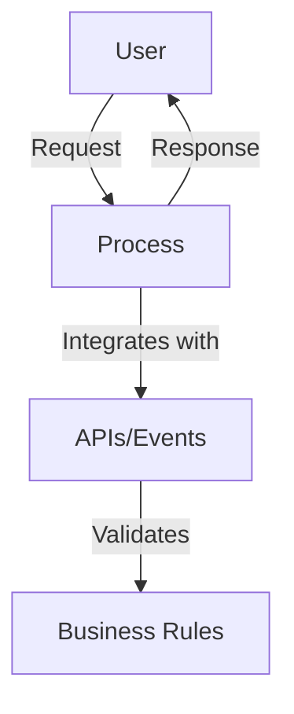
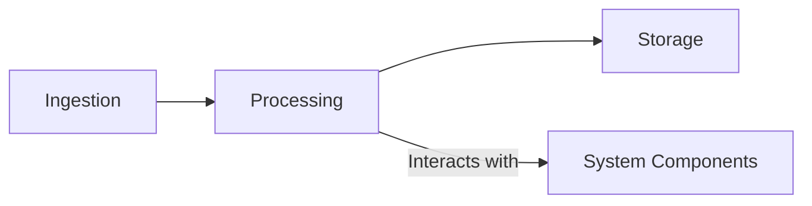

# Generative AI Applications Foundational Architecture

This project provides a scalable and efficient AWS foundational architecture for generative AI applications, enabling AI-driven tasks such as natural language processing and image recognition.

## Badges


## Overview

This project is an AWS foundational architecture for generative AI applications, designed to provide scalable and efficient solutions for AI-driven tasks. It leverages AWS services to ensure scalability, efficiency, and security, making it suitable for AI researchers, developers, and enterprises looking to integrate AI solutions.

## Architecture

### Logical Architecture


### Technical Architecture


## Features

- Scalable architecture leveraging AWS services
- Efficient data processing and storage
- Secure and compliant with industry standards
- Supports AI tasks like NLP and image recognition

## Prerequisites

- AWS services: S3, Lambda, API Gateway
- Development environment: Node.js, Python
- IAM roles and policies for access control
- Dependencies: Listed in `requirements.txt` and `package.json`

## Setup & Deployment

1. Clone the repository and navigate to the project directory.
2. Configure environment variables as per `.env.example`.
3. Provision AWS resources using CloudFormation.
4. Set up local development environment.
5. Deploy to production using CI/CD pipeline.

## Usage

### Basic Usage

```python
# Import the SDK
from sdk import GenAISDK

# Initialize the SDK
sdk = GenAISDK(api_key='your_api_key')

# Use the SDK to perform a task
result = sdk.perform_task('task_name')
print(result)
```

### Advanced Usage

```python
# Advanced usage with custom configurations
config = {
    'option1': 'value1',
    'option2': 'value2'
}

result = sdk.perform_advanced_task('task_name', config=config)
print(result)
```

## Configuration

- Environment variables are configured in the `.env` file.
- Configuration options are detailed in `config.py`.

## Security

- **Authentication**: Managed via AWS Cognito
- **Data Encryption**: S3 bucket encryption enabled
- **Network Security**: VPC and security groups configured

## Contributing

Please refer to the `CONTRIBUTING.md` file for guidelines on contributing to this project.

## License

This project is licensed under the terms of the LICENSE file.

## Project Structure

```
project-root/
├── admin-ui/
│   ├── frontend/
│   └── backend/
├── sdk/
├── services/
└── docs/
```
- **admin-ui/**: Contains the frontend and backend for the admin interface
- **sdk/**: Software development kit for interacting with the platform
- **services/**: Core services for processing and data management
- **docs/**: Documentation and guides

## References

- [AWS Documentation](https://aws.amazon.com/documentation/)
- [Nuxt.js Documentation](https://nuxt.com/docs/getting-started/introduction) 
