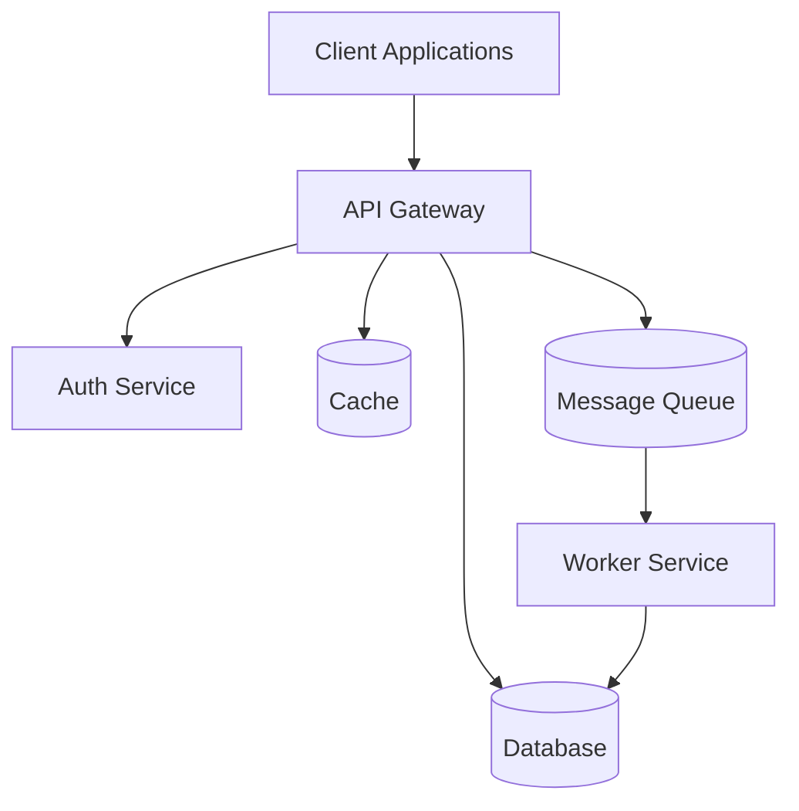
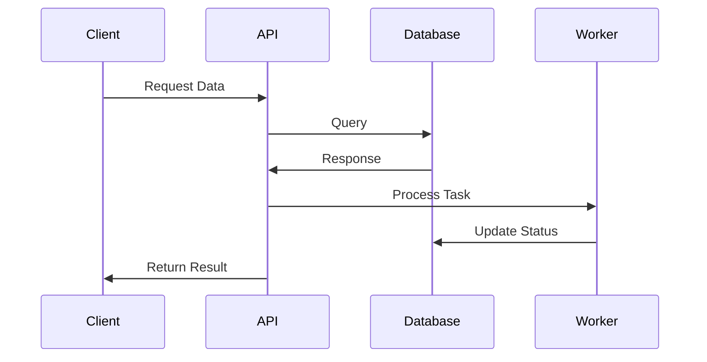
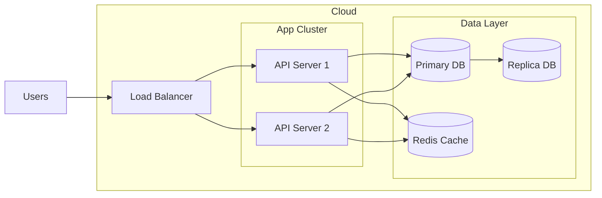

# AutoGPT: Build, Deploy, and Run AI Agents

[](https://discord.gg/autogpt) &ensp;
[](https://twitter.com/Auto_GPT) &ensp;
[](https://opensource.org/licenses/MIT)

**AutoGPT** is a powerful platform that allows you to create, deploy, and manage continuous AI agents that automate complex workflows. This documentation provides a comprehensive guide to setting up, using, and contributing to the AutoGPT project.

## Table of Contents
- [Features](#features)
- [Architecture](#architecture)
- [Prerequisites](#prerequisites)
- [Installation](#installation)
- [Configuration](#configuration)
- [Usage](#usage)
- [API Documentation](#api-documentation)
- [Development](#development)
- [Testing](#testing)
- [Deployment](#deployment)
- [Monitoring](#monitoring)
- [Troubleshooting](#troubleshooting)
- [Contributing](#contributing)
- [Security](#security)
- [License](#license)
- [Acknowledgments](#acknowledgments)

## Features
- **Agent Builder:** Customize AI agents with a low-code interface.
- **Workflow Management:** Build and optimize automation workflows.
- **Deployment Controls:** Manage agent lifecycle from testing to production.
- **Ready-to-Use Agents:** Access a library of pre-configured agents.
- **Monitoring and Analytics:** Track agent performance and gain insights.

## Architecture
This section provides a high-level overview of the system architecture.

### System Components


### Data Flow


### Deployment Architecture


## Prerequisites
- Runtime environment (e.g., Node.js v18+, Python 3.8+)
- Database (e.g., PostgreSQL 13+)
- Other system requirements (e.g., Docker, Redis)
- Required API keys or access tokens

## Installation
Step-by-step installation instructions:

```bash
# Clone the repository
git clone https://github.com/organization/project-name.git

# Navigate to project directory
cd project-name

# Install dependencies
npm install   # or equivalent for your stack

# Set up environment variables
cp .env.example .env
```

## Configuration
Explain configuration options and environment variables:

1. Required environment variables:
   - `DATABASE_URL`: Connection string for the database
   - `API_KEY`: Authentication key for external services
   - `PORT`: Server port (default: 3000)

2. Optional configurations:
   - `LOG_LEVEL`: Logging verbosity (default: info)
   - `CACHE_TTL`: Cache duration in seconds

## Usage
Provide examples of common use cases:

```javascript
// Basic usage example
const client = new ProjectClient();
const result = await client.doSomething();
```

## API Documentation
For REST APIs or libraries, document endpoints or main functions:

### Endpoint: `GET /api/v1/resource`
- Description: Retrieves resource data
- Parameters:
  - `id` (required): Resource identifier
  - `fields` (optional): Comma-separated list of fields
- Response format:
  ```json
  {
    "id": "string",
    "name": "string",
    "status": "string"
  }
  ```

## Development
Instructions for setting up development environment:

1. Development prerequisites
2. Code style guidelines
3. Branch naming conventions
4. Commit message format
5. Pull request process

## Testing
Explain testing procedures:

```bash
# Run unit tests
npm test

# Run integration tests
npm run test:integration

# Generate test coverage report
npm run test:coverage
```

## Deployment
Document deployment process:

1. Pre-deployment checklist
2. Deployment steps
3. Post-deployment verification
4. Rollback procedures

## Monitoring
Describe monitoring and logging:

1. Available metrics
2. Log locations
3. Health check endpoints
4. Alert configurations

## Troubleshooting
Common issues and solutions:

1. Problem: Description of common issue
   - Cause: Likely cause
   - Solution: Steps to resolve

2. Problem: Another common issue
   - Cause: Likely cause
   - Solution: Steps to resolve

## Contributing
Guidelines for contributing:

1. Fork the repository
2. Create a feature branch
3. Make your changes
4. Run tests
5. Submit a pull request

## Security
Security considerations and procedures:

- Security policy
- Vulnerability reporting process
- Security best practices
- Access control information

## License
This project is licensed under the MIT License - see the [LICENSE](LICENSE) file for details.

## Acknowledgments
- Credit to contributors
- Third-party libraries used
- Related projects or inspirations

---
**Note**: Customize this template by removing unnecessary sections or adding specific ones based on your project's needs. Keep documentation clear, concise, and up-to-date.

Last Updated: [DATE]

## Hosting Options 
   - Download to self-host
   - [Join the Waitlist](https://bit.ly/3ZDijAI) for the cloud-hosted beta  

## How to Setup for Self-Hosting
> [!NOTE]
> Setting up and hosting the AutoGPT Platform yourself is a technical process. 
> If you'd rather something that just works, we recommend [joining the waitlist](https://bit.ly/3ZDijAI) for the cloud-hosted beta.

https://github.com/user-attachments/assets/d04273a5-b36a-4a37-818e-f631ce72d603

This tutorial assumes you have Docker, VSCode, git and npm installed.

### 🧱 AutoGPT Frontend

The AutoGPT frontend is where users interact with our powerful AI automation platform. It offers multiple ways to engage with and leverage our AI agents. This is the interface where you'll bring your AI automation ideas to life:

   **Agent Builder:** For those who want to customize, our intuitive, low-code interface allows you to design and configure your own AI agents. 
   
   **Workflow Management:** Build, modify, and optimize your automation workflows with ease. You build your agent by connecting blocks, where each block     performs a single action.
   
   **Deployment Controls:** Manage the lifecycle of your agents, from testing to production.
   
   **Ready-to-Use Agents:** Don't want to build? Simply select from our library of pre-configured agents and put them to work immediately.
   
   **Agent Interaction:** Whether you've built your own or are using pre-configured agents, easily run and interact with them through our user-friendly      interface.

   **Monitoring and Analytics:** Keep track of your agents' performance and gain insights to continually improve your automation processes.

[Read this guide](https://docs.agpt.co/platform/new_blocks/) to learn how to build your own custom blocks.

### 💽 AutoGPT Server

The AutoGPT Server is the powerhouse of our platform This is where your agents run. Once deployed, agents can be triggered by external sources and can operate continuously. It contains all the essential components that make AutoGPT run smoothly.

   **Source Code:** The core logic that drives our agents and automation processes.
   
   **Infrastructure:** Robust systems that ensure reliable and scalable performance.
   
   **Marketplace:** A comprehensive marketplace where you can find and deploy a wide range of pre-built agents.

### 🐙 Example Agents

Here are two examples of what you can do with AutoGPT:

1. **Generate Viral Videos from Trending Topics**
   - This agent reads topics on Reddit.
   - It identifies trending topics.
   - It then automatically creates a short-form video based on the content. 

2. **Identify Top Quotes from Videos for Social Media**
   - This agent subscribes to your YouTube channel.
   - When you post a new video, it transcribes it.
   - It uses AI to identify the most impactful quotes to generate a summary.
   - Then, it writes a post to automatically publish to your social media. 

These examples show just a glimpse of what you can achieve with AutoGPT! You can create customized workflows to build agents for any use case.

---
### Mission and Licencing
Our mission is to provide the tools, so that you can focus on what matters:

- 🏗️ **Building** - Lay the foundation for something amazing.
- 🧪 **Testing** - Fine-tune your agent to perfection.
- 🤝 **Delegating** - Let AI work for you, and have your ideas come to life.

Be part of the revolution! **AutoGPT** is here to stay, at the forefront of AI innovation.

**📖 [Documentation](https://docs.agpt.co)**
&ensp;|&ensp;
**🚀 [Contributing](CONTRIBUTING.md)**

**Licensing:**

MIT License: The majority of the AutoGPT repository is under the MIT License.

Polyform Shield License: This license applies to the autogpt_platform folder. 

For more information, see https://agpt.co/blog/introducing-the-autogpt-platform

---
## 🤖 AutoGPT Classic
> Below is information about the classic version of AutoGPT.

**🛠️ [Build your own Agent - Quickstart](classic/FORGE-QUICKSTART.md)**

### 🏗️ Forge

**Forge your own agent!** &ndash; Forge is a ready-to-go toolkit to build your own agent application. It handles most of the boilerplate code, letting you channel all your creativity into the things that set *your* agent apart. All tutorials are located [here](https://medium.com/@aiedge/autogpt-forge-e3de53cc58ec). Components from [`forge`](/classic/forge/) can also be used individually to speed up development and reduce boilerplate in your agent project.

🚀 [**Getting Started with Forge**](https://github.com/Significant-Gravitas/AutoGPT/blob/master/classic/forge/tutorials/001_getting_started.md) &ndash;
This guide will walk you through the process of creating your own agent and using the benchmark and user interface.

📘 [Learn More](https://github.com/Significant-Gravitas/AutoGPT/tree/master/classic/forge) about Forge

### 🎯 Benchmark

**Measure your agent's performance!** The `agbenchmark` can be used with any agent that supports the agent protocol, and the integration with the project's [CLI] makes it even easier to use with AutoGPT and forge-based agents. The benchmark offers a stringent testing environment. Our framework allows for autonomous, objective performance evaluations, ensuring your agents are primed for real-world action.

<!-- TODO: insert visual demonstrating the benchmark -->

📦 [`agbenchmark`](https://pypi.org/project/agbenchmark/) on Pypi
&ensp;|&ensp;
📘 [Learn More](https://github.com/Significant-Gravitas/AutoGPT/tree/master/classic/benchmark) about the Benchmark

### 💻 UI

**Makes agents easy to use!** The `frontend` gives you a user-friendly interface to control and monitor your agents. It connects to agents through the [agent protocol](#-agent-protocol), ensuring compatibility with many agents from both inside and outside of our ecosystem.

<!-- TODO: insert screenshot of front end -->

The frontend works out-of-the-box with all agents in the repo. Just use the [CLI] to run your agent of choice!

📘 [Learn More](https://github.com/Significant-Gravitas/AutoGPT/tree/master/classic/frontend) about the Frontend

### ⌨️ CLI

[CLI]: #-cli

To make it as easy as possible to use all of the tools offered by the repository, a CLI is included at the root of the repo:

```shell
$ ./run
Usage: cli.py [OPTIONS] COMMAND [ARGS]...

Options:
  --help  Show this message and exit.

Commands:
  agent      Commands to create, start and stop agents
  benchmark  Commands to start the benchmark and list tests and categories
  setup      Installs dependencies needed for your system.
```

Just clone the repo, install dependencies with `./run setup`, and you should be good to go!

## 🤔 Questions? Problems? Suggestions?

### Get help - [Discord 💬](https://discord.gg/autogpt)

[](https://discord.gg/autogpt)

To report a bug or request a feature, create a [GitHub Issue](https://github.com/Significant-Gravitas/AutoGPT/issues/new/choose). Please ensure someone else hasn't created an issue for the same topic.

## 🤝 Sister projects

### 🔄 Agent Protocol

To maintain a uniform standard and ensure seamless compatibility with many current and future applications, AutoGPT employs the [agent protocol](https://agentprotocol.ai/) standard by the AI Engineer Foundation. This standardizes the communication pathways from your agent to the frontend and benchmark.

---

## Stars stats

<p align="center">
<a href="https://star-history.com/#Significant-Gravitas/AutoGPT">
  <picture>
    <source media="(prefers-color-scheme: dark)" srcset="https://api.star-history.com/svg?repos=Significant-Gravitas/AutoGPT&type=Date&theme=dark" />
    <source media="(prefers-color-scheme: light)" srcset="https://api.star-history.com/svg?repos=Significant-Gravitas/AutoGPT&type=Date" />
    
  </picture>
</a>
</p>


## ⚡ Contributors

<a href="https://github.com/Significant-Gravitas/AutoGPT/graphs/contributors" alt="View Contributors">
  
</a>
