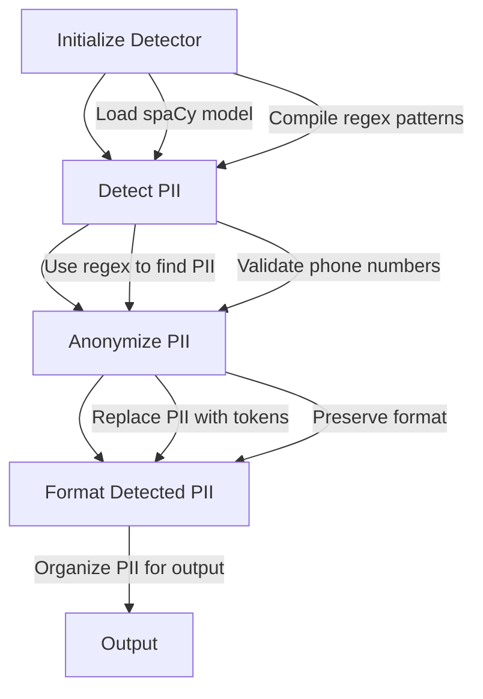

# Combined PII and Geo Detector

This project provides a Python class `CombinedPIIGeoDetector` that detects and anonymizes Personally Identifiable Information (PII) from text using regular expressions and the spaCy library.

## Features

- **Detection of PII**: Identifies various types of PII such as phone numbers, email addresses, credit card numbers, national IDs, IP addresses, and more.
- **Anonymization**: Replaces detected PII with anonymized tokens while preserving the original format.
- **Advanced Text Processing**: Utilizes spaCy for natural language processing tasks.

## Installation

1. **Python Version**: Ensure you have Python 3.6 or later installed.
2. **Install Required Packages**:
   ```bash
   pip install spacy
   python -m spacy download en_core_web_trf
   ```

## Usage

1. **Initialize the Detector**:
   ```python
   detector = CombinedPIIGeoDetector()
   ```
2. **Detect PII**:
   ```python
   text = "Contact me at john.doe@example.com or +1-800-555-0199."
   pii_entities = detector.detect_pii(text)
   print(detector.format_detected_pii(pii_entities))
   ```
3. **Anonymize PII**:
   ```python
   anonymized_text = detector.anonymize_other_sensitive_info(text)
   print(anonymized_text)
   ```

## Logical Flow

Below is a graphical representation of the logical flow of the code using Mermaid:



## Components

### CombinedPIIGeoDetector Class

- **Initialization**: Loads the spaCy model and compiles regex patterns for various PII types.
- **PII Detection**: Uses regex patterns to detect PII in text. Validates phone numbers with additional checks.
- **Anonymization**: Replaces detected PII with anonymized tokens while preserving the original format.
- **Helper Functions**: Includes functions like `is_valid_phone_number` to validate specific PII types.

### Functions

- **`detect_pii(text: str) -> Dict[str, List[Dict[str, Any]]]`**: Detects PII in the given text and returns a dictionary of detected entities.
- **`anonymize_phone_numbers(text: str) -> str`**: Anonymizes phone numbers in the text.
- **`anonymize_other_sensitive_info(text: str) -> str`**: Anonymizes all detected PII in the text.
- **`format_detected_pii(pii_dict)`**: Formats the detected PII dictionary for better readability.

## Use Cases

- **Data Privacy**: Anonymize sensitive information in documents to comply with data protection regulations.
- **Text Analysis**: Preprocess text data by removing PII before performing analysis.
- **Customer Support**: Automatically redact sensitive information from customer communications.

## Troubleshooting

- **Model Not Found**: If the spaCy model is not found, ensure it is installed correctly using `python -m spacy download en_core_web_trf`.
- **Regex Mismatches**: If certain PII types are not detected, verify the regex patterns in the `self.patterns` dictionary.
- **Performance Issues**: For large texts, consider optimizing regex patterns or using a more efficient text processing library.

## Example

```python
detector = CombinedPIIGeoDetector()
text = "Contact me at john.doe@example.com or +1-800-555-0199."
pii_entities = detector.detect_pii(text)
print(detector.format_detected_pii(pii_entities))
anonymized_text = detector.anonymize_other_sensitive_info(text)
print(anonymized_text)
```

## License

This project is licensed under the MIT License. 

## Contributing

Contributions are welcome! Please feel free to submit a Pull Request.

## Contact

For any questions or issues, please contact the project maintainer. 