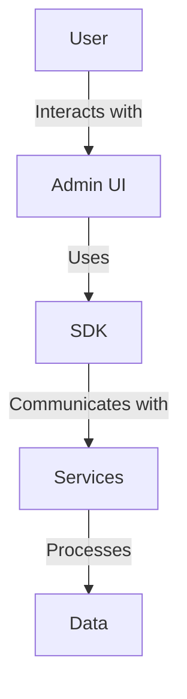
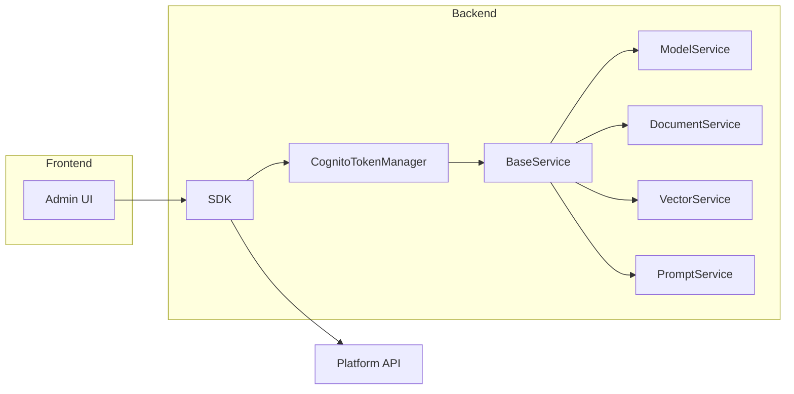

# Project Name

## Introduction
This project is a Generative AI application built on the GenAI Foundational Platform. It provides a suite of services for vectorization, document processing, model invocation, and prompt management.

## Installation
1. Clone the repository:
   ```bash
   git clone <repository-url>
   ```
2. Navigate to the project directory:
   ```bash
   cd <project-directory>
   ```
3. Install the required dependencies:
   ```bash
   pip install -r sdk/reqs.txt
   ```

## Usage
- To get started with the SDK, refer to the `quickstart-sdk.ipynb` notebook in the `sdk/` directory.
- Ensure you have a `.env` file with the necessary environment variables for authentication and API access.

## Architecture
### Logical Architecture


### Technical Architecture


## Frontend
The frontend is built using Nuxt.js and Tailwind CSS, providing a responsive and interactive admin interface.
- **Components**: Reusable Vue.js components located in `components/`.
- **Pages**: Application pages structured in `pages/`.
- **Layouts**: Layout templates in `layouts/`.
- **Plugins**: Custom plugins in `plugins/`.
- **Middleware**: Request handling logic in `middleware/`.

## Backend
The backend is a Python application, providing APIs and server-side logic.
- **Main Application**: Entry point in `main.py`.
- **Routes**: Defined in `relay_routes.py` and `metric_routes.py`.
- **Models**: Data models in `models.py`.
- **Utilities**: Helper functions in `utils.py`.
- **Configuration**: Settings in `config.py`.
- **Dependencies**: Managed in `dependencies.py`.

## Services Overview
- **Vectorization**: Handles vector store and index creation, vectorization, and semantic search.
- **Document Processing**: Manages file registration, extraction, and chunking.
- **Model Invocation**: Provides methods to list and invoke models with prompts.
- **Prompt Management**: Manages prompt templates, including creation and retrieval.

## Contributing
Please refer to the `CONTRIBUTING.md` file for guidelines on contributing to this project.

## License
This project is licensed under the terms of the LICENSE file. 
